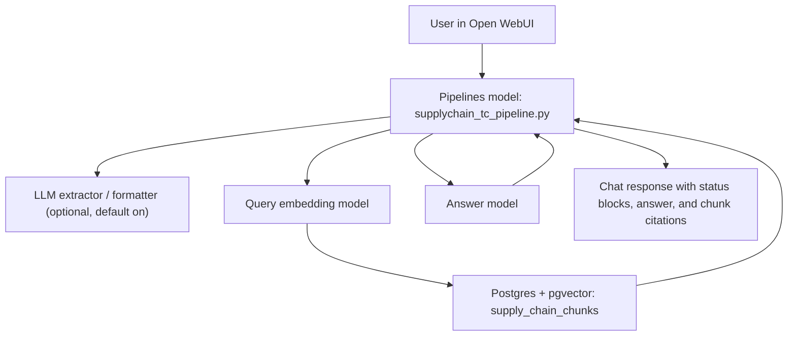

# Supply Chain Pipeline Technical Architecture

This document explains how the implementation works at the code level.

Primary runtime file:

- `pipelines/supplychain_tc_pipeline.py`

Primary ingestion file:

- `scripts/ingest_supply_chain_txt.py`

Shared storage target:

- Postgres + pgvector table `supply_chain_chunks`

Default collection:

- `GSC-Internal-Policy`

## 1. High-Level Architecture

The runtime and ingestion flows are intentionally separate:

- The chat pipeline parses user questions and chat history at query time.
- The seed script parses source `.txt` files and writes vector rows ahead of time.

## 2. Runtime Pipeline Call Flow

### Entry point

The Open WebUI Pipelines server calls:

- `Pipeline.pipe(user_message, model_id, messages, body)`

Important special cases inside `pipe()`:

1. If `body["title"]` is set, the pipeline returns only the model name.
2. If `body["stream"]` is true, `pipe()` returns a generator.
3. Otherwise, `pipe()` joins the generator output into a single string.

The actual work happens in:

- `_pipe_gen(...)`

### Runtime sequence

The main execution path inside `_pipe_gen(...)` is:

1. Validate that chat messages exist.
2. Extract the latest user text with `_message_text(...)`.
3. Handle reset commands with `_is_reset(...)`.
4. Reconstruct prior conversational state from earlier user turns with `_derive_prior_state(...)`.
5. Run deterministic parsing on the current message with `_extract_fields(...)`.
6. Optionally run the LLM extractor with `_extract_with_llm(...)`.
7. Optionally run the LLM formatter with `_format_with_llm(...)`.
8. Merge deterministic and LLM results with `_resolve_input_fields(...)`.
9. Classify the turn with `_classify_turn(...)`.
10. Merge prior context and current inputs with `_merge_state(...)`.
11. Check for missing fields with `_missing_fields(...)`.
12. If required inputs are missing, return a targeted prompt from `_build_missing_message(...)`.
13. Emit a `Search` status block and a `Retrieval` status block.
14. Run retrieval with `_search_guidance(...)`.
15. If there are no hits, emit `No Hits` status and return the no-hit message.
16. Build LLM grounding messages with `_build_grounding_messages(...)`.
17. Generate the answer with `_generate_answer(...)`.
18. If answer generation fails, fall back to `_fallback_answer(...)`.
19. Prepend any provenance warning from `_provenance_notice(...)`.
20. Append the deterministic citation appendix from `_render_retrieved_chunk_citations(...)`.
21. Yield the final answer body.

## 3. Runtime State Model

The pipeline does not maintain server-side session memory.

Instead, every invocation derives state from the chat history:

- `clause_number`
- `termset_number`
- `query_text`

This happens in:

- `_derive_prior_state(...)`

That function replays earlier user messages through:

- `_extract_fields(...)`
- `_classify_turn(...)`
- `_merge_state(...)`

As a result, follow-up behavior is deterministic and stateless from the server's perspective.

## 4. Parsing And Routing Logic

### Deterministic parsing

The first parsing pass is `_extract_fields(text)`.

It uses:

- `CLAUSE_RE` for clause references such as `clause 10`
- `TERMSET_LABEL_RE` for forms such as `termset 3`, `termet 3`, `T&C 3`
- `TERMSET_CODE_RE` for full identifiers such as `CTM-P-ST-003`

What `_extract_fields(...)` returns:

- `clause_number`
- `termset_number`
- `query_text`

It also enforces the "one clause, one termset" rule:

- if multiple clause numbers are detected, it raises an error
- if multiple distinct termsets are detected, it raises an error

For `query_text`, the function removes recognized identifiers and common lead-in phrases such as:

- `what does`
- `explain`
- `check`
- `show me`

If the message looks like a pure follow-up, `query_text` is set to `None`.

### LLM-first extraction and formatting

By default, the pipeline uses:

- `ROUTER_MODE=extractor_assisted`
- `ENABLE_LLM_EXTRACTOR=true`
- `ENABLE_LLM_FORMATTER=true`

The LLM extraction path is:

1. `_extract_with_llm(current_text, prior_state, deterministic)`
2. `_format_with_llm(current_text, prior_state, deterministic, extractor_result)`

Both calls send structured JSON context into the configured chat model and expect strict JSON back.

Expected JSON keys:

- `clause_number`
- `termset_number`
- `query_text`
- `intent`
- `has_required_inputs`

The parser for those outputs is:

- `_parse_json_object(...)`

### Precedence rules

The merge logic is implemented in:

- `_resolve_input_fields(...)`

Behavior:

- Deterministic clause and termset values override conflicting LLM values.
- The formatter result takes precedence over the extractor result.
- Query text is cleaned by `_clean_query_text(...)`.
- Termset normalization is handled by `_normalize_termset_number(...)`.

### Turn classification

Turn classification is handled by:

- `_classify_turn(...)`

Supported decisions:

- `new_search`
- `identifier_update`
- `same_context_new_query`
- `followup_explain`
- `collect_or_search`

Classification inputs:

- current parsed fields
- prior state completeness
- extractor intent
- follow-up cue phrases in the current message

### State merge

State merge is handled by:

- `_merge_state(...)`

Rules:

- explicit current values replace prior values
- follow-up explanation turns preserve the previous `query_text` when the current message contains no new query body

### Missing-field prompts

Required search inputs are:

- `clause_number`
- `termset_number`
- `query_text`

The check happens in:

- `_missing_fields(...)`

The prompt returned to the user is built by:

- `_build_missing_message(...)`

That function asks only for the missing field(s), not for fields the pipeline already has.

## 5. Status Emission

The pipeline does not use a true Open WebUI backend event emitter.

Instead it emits inline assistant content blocks using:

- `_status_details(title, body, done=False)`

Those blocks render as:

- `
`

Status stages currently emitted:

- `Search`
- `Retrieval`
- `Done`
- `No Hits`
- `Error`

The message for the `Search` block is built by:

- `_status_decision(...)`
- `_search_status_message(...)`

This keeps the status text aligned with the real conversational behavior:

- starting a new search
- reusing current context
- using updated identifiers

## 6. Retrieval Path

The retrieval entry point is:

- `_search_guidance(collection_name, clause_number, termset_number, query, top_k)`

### Retrieval steps

1. `_ensure_schema()` ensures the table and indexes exist.
2. `_embed_text(query)` creates the query embedding.
3. `_vector_literal(...)` formats the embedding for pgvector SQL.
4. SQL filters by:
   - `collection_name`
   - `clause_number_norm`
   - `tc_number_norm`
5. Within that filtered set, rows are ordered by vector distance:
   - `ORDER BY embedding <=> %s::vector`
6. The top `TOP_K` rows are returned.

Important compatibility detail:

- the logical user-facing `termset_number` is stored in the existing DB fields `tc_number` and `tc_number_norm`

That means the runtime is termset-based, but it reuses the earlier column naming for compatibility.

## 7. Grounding And Answer Generation

### Grounding prompt construction

The prompt for the answer model is built by:

- `_build_grounding_messages(...)`

For each hit, the prompt includes:

- source label `[S1]`, `[S2]`, etc.
- `source_doc`
- `section_title`
- `collection_name`
- `termset`
- retrieval `score`
- full `chunk_text`

Important point:

- The answer model sees full chunk text, not just a one-line summary.

### Answer generation

The answer model call is:

- `_generate_answer(messages)`

That delegates to:

- `_chat_completion(...)`

The system prompt instructs the model to:

- answer only from retrieved guidance
- avoid inventing policy
- cite claims with `[S1]`, `[S2]`
- treat `Issue:` / `Response:` pairs as especially important

### Fallback behavior

If answer generation fails:

- `_fallback_answer(...)`

returns a deterministic summary from the top hits.

### Provenance warning

The runtime checks hit metadata with:

- `_provenance_notice(...)`

Possible provenance notes include:

- placeholder/template content
- synthetic demo content

### Final citation appendix

The final answer always appends:

- `_render_retrieved_chunk_citations(hits)`

This section exposes the exact retrieved rows, including:

- `[S1]`, `[S2]`, etc.
- `source_doc`
- `section_title`
- `external_id`
- vector `score`
- `segment_title`
- `chunk_index`
- a shortened excerpt of the actual chunk text

## 8. Provider Abstraction

Both chat generation and embeddings support:

- `ollama`
- `azure_openai`

Provider helpers:

- `_resolve_provider(...)`
- `_resolve_chat_model(...)`
- `_resolve_embedding_model(...)`

Network call helpers:

- `_chat_completion(...)`
- `_embed_text(...)`
- `_post_json(...)`

Current defaults:

- answer model: Ollama `gpt-oss:20b`
- extractor model: Ollama `gpt-oss:20b`
- formatter model: Ollama `gpt-oss:20b`
- embedding model: Ollama `nomic-embed-text`

## 9. Runtime Database Schema

The runtime bootstraps the shared table in:

- `_ensure_schema(...)`

Schema columns:

- `id`
- `collection_name`
- `external_id`
- `clause_number`
- `clause_number_norm`
- `tc_number`
- `tc_number_norm`
- `topic`
- `source_doc`
- `section_title`
- `chunk_text`
- `guidance_text`
- `metadata JSONB`
- `embedding VECTOR(<dimensions>)`
- timestamps

Indexes:

- unique index on `(collection_name, external_id)`
- filter index on `(collection_name, clause_number_norm, tc_number_norm)`
- HNSW vector index on `embedding`

## 10. Ingestion Script Call Flow

The ingestion entry point is:

- `scripts/ingest_supply_chain_txt.py`
- `main()`

### CLI flow

`main()` runs this sequence:

1. `parse_args()`
2. `collect_txt_files(input_path)`
3. for each file, `build_rows_for_file(path, args)`
4. if `--dry-run`, print the report and exit
5. `ensure_schema(...)`
6. if `--replace-collection`, `delete_collection(...)`
7. embed every prepared row with `embed_text(...)`
8. write rows with `upsert_rows(...)`
9. optionally delete additional collections with `--delete-collection`
10. print the final JSON report

## 11. How The `.txt` Files Are Parsed

### File discovery

`collect_txt_files(...)`:

- accepts either a single `.txt` file or a directory
- prefers files matching the clause filename pattern `NN_name.txt`
- otherwise falls back to all `.txt` files under the path

### Text cleanup

`clean_text(raw)` normalizes:

- line endings
- embedded HTML tags
- HTML entities
- repeated blank lines

This allows the script to work with either plain text or HTML-ish exported text.

### Clause structure parsing

`parse_clause_document(path)` is the main parser.

It calls:

1. `_find_clause_heading(lines)`
2. `_find_applicable_block(lines, heading_idx + 1)`
3. `_clean_clause_body(lines, heading_idx, applicable_start, applicable_end)`
4. `_detect_source_status(text)`
5. `segment_clause_body(body)`

What it extracts:

- `clause_number`
- `clause_title`
- `full_termset_codes`
- normalized `termset_numbers`
- cleaned clause `body`
- segmented section list
- `source_status`

### Applicable For parsing

`_find_applicable_block(...)` looks for:

- `Applicable For`
- or the two-line form:
  - `Applicable`
  - `For`

It then collects one or more:

- `CTM-P-ST-###`

The normalized termset suffixes are produced by:

- `normalize_termset_number(...)`

Examples:

- `CTM-P-ST-001` -> `001`
- `CTM-P-ST-7` -> `007`

### Source-status detection

`_detect_source_status(...)` maps file text into one of:

- `synthetic_demo`
- `template_placeholder`
- `provided_transcription`
- `authoritative`

Current behavior:

- files with `Demo note:` seed as `synthetic_demo`
- files with old `TODO` or `Repository note:` seed as `template_placeholder`
- files with `[unclear]` or transcription markers seed as `provided_transcription`

### Body cleanup

`_clean_clause_body(...)` removes:

- repository notes
- table of contents scaffolding
- the `Applicable / For` block
- `Back to HomePage`

What remains is the substantive clause body.

### Section segmentation

`segment_clause_body(body)` turns the cleaned body into logical sections.

Major section headings recognized:

- `Intent`
- `Common Exceptions / Suggested Responses`
- `Suggested Responses`
- `Additional Resources`
- `References`

Subsections recognized:

- `Subparagraph A`
- `Subparagraph B`
- `Subparagraph C`
- and other `Subparagraph <token>` variants

Each output segment becomes:

- `title`
- `text`

## 12. Chunking And Row Construction

`build_rows_for_file(...)` is the bridge between parsed clause text and database rows.

### Segment chunking

For each parsed segment:

1. `chunk_segment_text(segment_title, segment_text, chunk_size, chunk_overlap)`
2. which delegates to `chunk_text(...)`

Current chunking behavior:

- split by word count
- prefix each chunk with the segment title
- preserve overlap across chunks

### Row duplication by termset

Each clause file may apply to multiple termsets.

The script duplicates each chunk once per applicable termset.

For example:

- if Clause 1 applies to `001`, `002`, `004`, and `006`
- each clause chunk is written four times
- the content is the same, but `tc_number` and termset metadata differ

This keeps runtime filtering simple and exact.

### Row payload

For each chunk-termset pair, the script writes:

- `collection_name`
- `external_id`
- `clause_number`
- `tc_number`
- `topic`
- `source_doc`
- `section_title`
- `chunk_text`
- `guidance_text`
- `metadata`

`external_id` is a SHA-256 hash of:

- collection
- filename
- clause number
- termset number
- chunk index

### Metadata payload

The JSON metadata currently includes:

- `source_format`
- `source_path`
- `clause_title`
- `termset_number`
- `termset_code_full`
- `all_applicable_termsets`
- `all_applicable_termset_codes`
- `source_status`
- `is_placeholder`
- `segment_title`
- `chunk_index`

## 13. How Rows Are Embedded And Stored

After rows are prepared:

1. `embed_text(row["chunk_text"], args)` creates the vector embedding
2. `ensure_schema(...)` creates the table and indexes if needed
3. `upsert_rows(...)` inserts or updates the rows

`upsert_rows(...)` normalizes the filter columns:

- `clause_number_norm`
- `tc_number_norm`

Those normalized columns are what the runtime search path filters on before vector ranking.

## 14. End-To-End Example

User asks:

- `What does clause 10 say about indemnity for termset 3?`

Runtime path:

1. `pipe()` -> `_pipe_gen()`
2. `_extract_fields()` finds:
   - `clause_number = 10`
   - `termset_number = 003`
   - `query_text = indemnity`
3. extractor and formatter may refine the values
4. `_classify_turn()` returns `new_search`
5. `_search_guidance()` embeds `indemnity`
6. SQL filters rows where:
   - `collection_name = 'GSC-Internal-Policy'`
   - `clause_number_norm = '10'`
   - `tc_number_norm = '003'`
7. pgvector ranks the matching clause/termset rows by cosine distance
8. `_build_grounding_messages()` packages the top hits for the answer model
9. `_generate_answer()` writes the natural-language response
10. `_render_retrieved_chunk_citations()` appends the deterministic chunk list

Ingestion path for the same clause:

1. `parse_clause_document("10_indemnification.txt")`
2. parser extracts:
   - heading `10. Indemnification`
   - applicable termsets `003`, `004`, `005`, `007`
   - cleaned clause body
   - segments like `Intent`, `Suggested Responses | Subparagraph A`
3. `build_rows_for_file(...)` chunks each segment
4. each chunk is duplicated once per applicable termset
5. rows are embedded and upserted into `supply_chain_chunks`

## 15. Practical Notes

- The pipeline is stateless between requests except for the chat history it is given on each call.
- The runtime always filters by collection, clause, and termset before vector ranking.
- The answer model never queries the database directly; only the pipeline does.
- The ingestion script is the only place where source `.txt` files are parsed.
- The runtime never parses the clause documents themselves.
